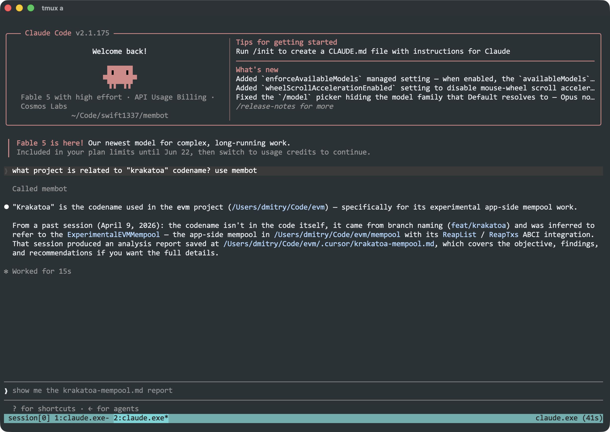
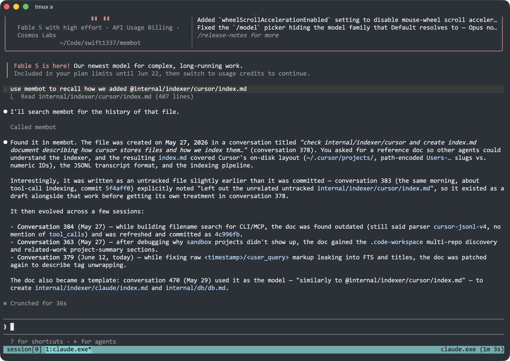

<p align="center">
  
</p>

# Membot

`membot` automatically indexes your AI history, so future agents can recall past decisions, fixes, files,
and tool calls through the CLI or MCP.

Give it a try and boost your clankers 🤖!

## Highlights

- [x] ClaudeCode, Codex, and Cursor are supported
- [x] Automatic background indexing on MacOS, including tool calls
- [x] Query by keyword, agent, time or related files
- [x] Use as CLI or add it as MCP to any tool
- [x] Local storage, works fully offline.

## Examples





## Install

Install with Go:

```bash
go install github.com/swift1337/membot/cmd/membot@latest

# index all chats
membot index all

# install MacOs background service for auto-indexing
membot service install
```

By default, `membot` creates a SQLite database at `~/.membot/membot.db`.

## Quickstart

Search your memory:

```sh
membot query "sqlite migration" --text
membot query '(sqlite OR sqlc) AND migration' --project membot --text
membot query "debug CI" --agent cursor --since 1w --limit 10 --text
```

Find conversations that touched a file:

```sh
membot query files internal/mcp/tools.go --project acme --text
```

List projects and index stats:

```sh
membot query projects --text
membot index stats
```

Keep the index fresh on macOS:

```sh
membot service install
membot service status
```

## CLI Examples

Index one source:

```sh
membot index cursor
membot index claude
membot index codex
```

Index custom roots:

```sh
membot index all \
  --cursor-root ~/.cursor/projects \
  --claude-root ~/.claude \
  --codex-root ~/.codex
```

Rebuild from scratch:

```sh
membot index cursor --reindex
membot index claude
membot index codex
```

Return JSON for scripts:

```sh
membot query "cursor transcripts"
```

Use aliases when you are moving fast:

```sh
membot q "release notes" --text
membot query f README.md --project membot --text
```

## MCP

Run `membot` as an MCP server so ant MCP clients can search indexed
history without shelling out to the CLI.

```json
{
  "mcpServers": {
    "membot": {
      "command": "membot",
      "args": ["mcp"]
    }
  }
}
```

Then index transcripts first:

```sh
membot index all
```

Available MCP tools:

- `search`: full-text search over indexed assistant messages.
- `search_file_context`: find conversations linked to a filename or path.
- `list_projects`: list indexed projects for project filters.

The MCP server speaks over stdin/stdout and is read-only. Use `--db` to point it
at a non-default database.

## Notes

- Query terms use prefix full-text search. Adjacent terms are combined with
  `AND`; use uppercase `OR` and parentheses for grouping.
- File context search matches indexed code citations, inline paths, at-path
  references, and tool file operations.
- Cursor indexing also records repos referenced by `.code-workspace` files.
- `membot service install` creates a macOS LaunchAgent that runs
  `membot index all --watch`.

## Development

```sh
make build
make codegen
make lint
```

`make codegen` regenerates the sqlc database package in `internal/db`.
