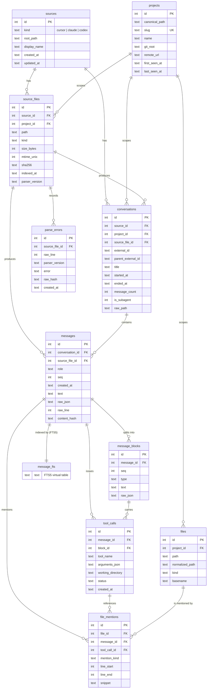

# Database schema

`membot` stores all indexed assistant history in a single SQLite database. The
schema is defined in [`internal/store/migrations/001_initial.sql`](../store/migrations/001_initial.sql)
and the Go bindings in this package are generated by sqlc from
[`internal/db/queries/`](./queries). This document visualizes the schema and
explains the relationships.

## Entity relationship diagram

## Tables

| Table            | Purpose                                                                                                                                                                                          |
| ---------------- | ------------------------------------------------------------------------------------------------------------------------------------------------------------------------------------------------ |
| `sources`        | One row per indexed agent root. `kind` is `cursor`, `claude`, or `codex`; unique on `(kind, root_path)`.                                                                                         |
| `projects`       | Workspaces/repos. Unique on `slug`; `canonical_path` reconstructed from the slug when possible.                                                                                                  |
| `source_files`   | Each indexed transcript file with `sha256`, `mtime_unix`, `size_bytes`, and `parser_version` for incremental skip. Unique on `(source_id, path)`.                                                |
| `conversations`  | A chat session (one transcript file). `external_id` is the file UUID; `parent_external_id` + `is_subagent` link subagent runs. Unique on `(source_id, external_id)`.                             |
| `messages`       | One row per transcript line. `seq` is 1-based; `text` is the flattened searchable body; `raw_json` keeps the original line. Unique on `(conversation_id, seq)` and `(source_file_id, raw_line)`. |
| `message_blocks` | Content blocks within a message (`text`, `tool_use`, `tool_result`, …). Unique on `(message_id, seq)`.                                                                                           |
| `tool_calls`     | Decoded `tool_use` blocks: `tool_name`, `arguments_json`, `working_directory`, `status`.                                                                                                         |
| `files`          | Distinct file paths referenced anywhere. `normalized_path` and `basename` power lookup. Unique on `(project_id, path)`.                                                                          |
| `file_mentions`  | Links a `file` to the `message` and/or `tool_call` that referenced it, with `mention_kind` and optional line range.                                                                              |
| `parse_errors`   | Non-fatal malformed lines: line number, error text, raw-line hash.                                                                                                                               |
| `message_fts`    | FTS5 virtual table mirroring `messages.text` for full-text search.                                                                                                                               |

## Full-text search

`message_fts` is an external-content FTS5 table (`content='messages'`,
`content_rowid='id'`, `tokenize='unicode61'`). It is kept in sync by three
triggers on `messages`:

- `messages_ai` — after insert, indexes the new text.
- `messages_ad` — after delete, removes the old text.
- `messages_au` — after update, replaces the old text with the new.

Search joins `message_fts` back to `messages` → `conversations` → `projects`.

## Indexes

| Index                            | Columns                                      | Speeds up                        |
| -------------------------------- | -------------------------------------------- | -------------------------------- |
| `idx_conversations_project_time` | `conversations(project_id, started_at DESC)` | Recent conversations per project |
| `idx_messages_conversation_seq`  | `messages(conversation_id, seq)`             | Ordered message replay           |
| `idx_messages_created_at`        | `messages(created_at)`                       | Time-range queries               |
| `idx_file_mentions_file`         | `file_mentions(file_id)`                     | File → mentions lookup           |
| `idx_files_project_basename`     | `files(project_id, basename)`                | File context search by basename  |

## Notes

- All timestamps are stored as TEXT (RFC3339, UTC). Booleans (`is_subagent`) are
  stored as INTEGER `0`/`1`.
- Re-indexing a changed transcript replaces that conversation's rows within a
  single transaction; `--reindex` drops the whole database.
- See [`internal/indexer/cursor/index.md`](../indexer/cursor/index.md),
  [`internal/indexer/claude/index.md`](../indexer/claude/index.md), and
  [`internal/indexer/codex/index.md`](../indexer/codex/index.md) for how each
  source maps onto these tables.
